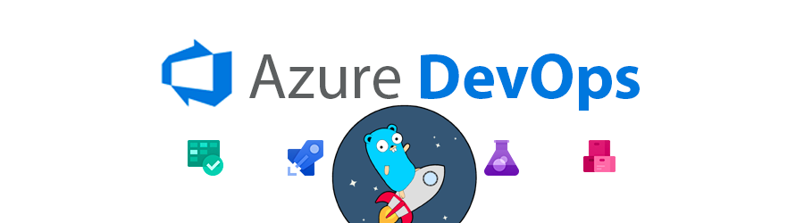
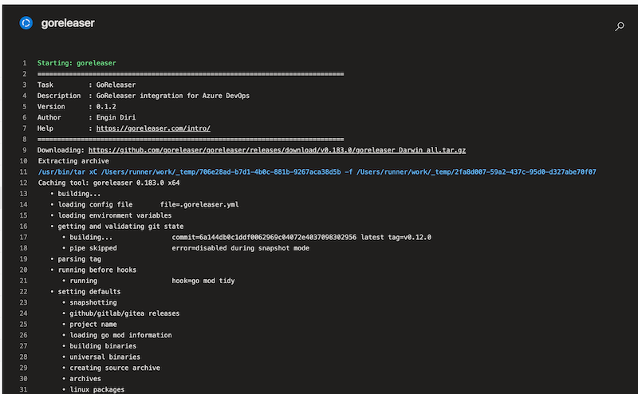
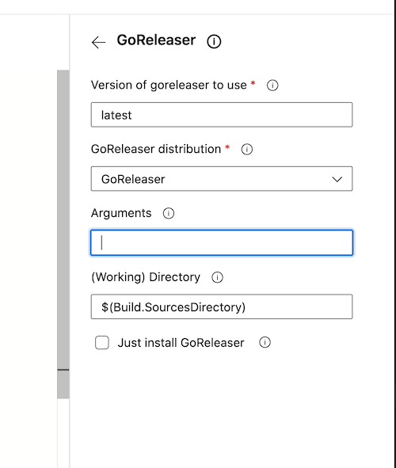
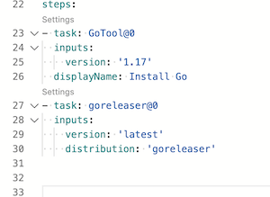

# GoReleaser: Azure DevOps Extension
[](https://github.com/goreleaser/goreleaser-azure-devops-extension/releases/latest)
[](LICENSE)
[](https://github.com/goreleaser/goreleaser-azure-devops-extension/actions?workflow=build)


[](https://discord.gg/RGEBtg8vQ6)
[](https://twitter.com/goreleaser)
[](https://x.com/goreleaser)

[](https://api.securityscorecards.dev/projects/github.com/goreleaser/goreleaser-azure-devops-extension)

## Overview

This task allows you to easily run GoReleaser within your Azure Pipeline jobs.

## Howto

See the blog article [Use GoReleaser With Azure DevOps](https://blog.goreleaser.com/use-goreleaser-with-azure-devops-c2212d3996ca)
for a detailed explanation of how to use this extension in your Azure Pipeline jobs.

## QuickStart



## Customizing

Add the plugin via Azure Pipeline Editor



or directly into your `azure-pipeline.yaml`



````yaml
- task: goreleaser@0
  inputs:
    version: 'latest'
    distribution: 'goreleaser'
    args: ''
    workdir: '$(Build.SourcesDirectory)'
````

### Inputs

Following inputs can be used

| Name           | Type   | Default                     | Description                                                      |
|----------------|--------|-----------------------------|------------------------------------------------------------------|
| `distribution` | String | `goreleaser`                | GoReleaser distribution, either `goreleaser` or `goreleaser-pro` |
| `version`**¹** | String | `latest`                    | GoReleaser version                                               |
| `args`         | String |                             | Arguments to pass to GoReleaser                                  |
| `workdir`      | String | `$(Build.SourcesDirectory)` | Working directory (below repository root)                        |
| `installOnly`  | Bool   | `false`                     | Just install GoReleaser                                          |

> **¹** Can be a fixed version like `v0.132.0` or a max satisfying semver one like `~> 0.132`. In this case this will return `v0.132.1`.
> For the `pro` version, add `-pro` to the string

### Environment variables

Following environment variables can be used, as environment variable.

| Name             | Description                                                                                                                                            |
|------------------|--------------------------------------------------------------------------------------------------------------------------------------------------------|
| `GITHUB_TOKEN`   | [GITHUB_TOKEN](https://help.github.com/en/actions/configuring-and-managing-workflows/authenticating-with-the-github_token) for e.g. `brew` or `gofish` |
| `GORELEASER_KEY` | Your [GoReleaser Pro](https://goreleaser.com/pro) License Key, in case you are using the `goreleaser-pro` distribution                                 |

## Limitation

I think, you should either disable the [release step](https://goreleaser.com/customization/release/). Or create a "
dummy" repo in GitHub, so you can still use your own `homebrew tap` or `gofish` repo.

GoReleaser is not supporting Azure Artifacts currently.

You need to use `Publish Pipeline Artifacts` to publish the artifact inside Azure DevOps.

## Tutorials 

- [Use GoReleaser With Azure DevOps](https://blog.goreleaser.com/use-goreleaser-with-azure-devops-c2212d3996ca)
- [Releasing multi-platform container images with GoReleaser in Azure DevOps
  ](https://blog.goreleaser.com/releasing-multi-platform-container-images-with-goreleaser-in-azure-devops-d8916df4250a)

## Documentation

Please refer to [https://goreleaser.com/intro/](https://goreleaser.com/intro/) for more documentation on using
GoReleaser.

# Links

- Follow the progress on the [GitHub repository](https://github.com/goreleaser/goreleaser)
- Follow [@goreleaser](https://twitter.com/goreleaser) on Twitter for updates
- Join our [Discord server](https://discord.gg/RGEBtg8vQ6)
- Ask questions on [StackOverflow](https://stackoverflow.com/questions/tagged/goreleaser)
- For questions, support and general discussion, please use
  [GitHub Discussions](https://github.com/goreleaser/goreleaser/discussions);
- [Contributing Guidelines](https://github.com/goreleaser/goreleaser/blob/master/CONTRIBUTING.md)

# License

MIT

see [LICENSE](https://github.com/goreleaser/goreleaser-azure-devops-extension/blob/master/LICENSE) for details.
